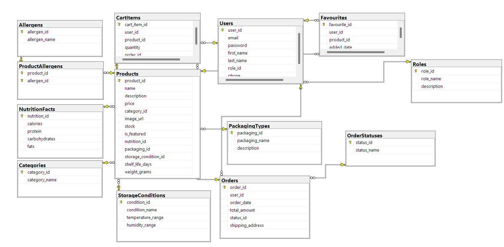

# Магазин антиквариата

## Описание предметной области

База данных представляет систему для антикварного магазина. В ней отслеживаются пользователи, их роли и их заказы. Клиенты могут просматривать товары, отсортированные по категориям, цветам и размерам. Каждый товар имеет описание, цену, путь изображения и информацию о наличии на складе. Магазин управляет заказами, отслеживая дату заказа, общую сумму и текущий статус. Система также отслеживает товары в корзине, что позволяет клиентам добавлять товары в свои корзины перед покупкой.

## Структура базы данных

### CREATE-выражения таблиц
```sql
CREATE TABLE Categories (
    category_id INT IDENTITY(1,1) PRIMARY KEY,
    category_name VARCHAR(255) NOT NULL
);

CREATE TABLE Colors (
    color_id INT IDENTITY(1,1) PRIMARY KEY,
    color_name VARCHAR(255) NOT NULL
);

CREATE TABLE OrderStatuses (
    status_id INT IDENTITY(1,1) PRIMARY KEY,
    status_name VARCHAR(255) NOT NULL
);

CREATE TABLE Products (
    product_id INT IDENTITY(1,1) PRIMARY KEY,
    name VARCHAR(255) NOT NULL,
    description TEXT,
    price DECIMAL(10, 2) NOT NULL,
    category_id INT NOT NULL,
    image_url VARCHAR(255),
    stock INT NOT NULL,
    is_featured BIT NOT NULL,
    size_id INT NOT NULL,
    color_id INT NOT NULL,
    FOREIGN KEY (category_id) REFERENCES Categories(category_id),
    FOREIGN KEY (size_id) REFERENCES Sizes(size_id),
    FOREIGN KEY (color_id) REFERENCES Colors(color_id)
);

CREATE TABLE Roles (
    role_id INT IDENTITY(1,1) PRIMARY KEY,
    role_name VARCHAR(255) NOT NULL,
    description TEXT
);

CREATE TABLE Sizes (
    size_id INT IDENTITY(1,1) PRIMARY KEY,
    size_name VARCHAR(255) NOT NULL
);

CREATE TABLE Users (
    user_id INT IDENTITY(1,1) PRIMARY KEY,
    email VARCHAR(255) NOT NULL UNIQUE,
    password VARCHAR(255) NOT NULL,
    first_name VARCHAR(255) NOT NULL,
    last_name VARCHAR(255) NOT NULL,
    role_id INT NOT NULL,
    phone VARCHAR(20),
    FOREIGN KEY (role_id) REFERENCES Roles(role_id)
);

CREATE TABLE CartItems (
    cart_item_id INT IDENTITY(1,1) PRIMARY KEY,
    user_id INT NOT NULL,
    product_id INT NOT NULL,
    quantity INT NOT NULL,
    FOREIGN KEY (user_id) REFERENCES Users(user_id),
    FOREIGN KEY (product_id) REFERENCES Products(product_id)
);

CREATE TABLE Orders (
    order_id INT IDENTITY(1,1) PRIMARY KEY,
    user_id INT NOT NULL,
    order_date DATE NOT NULL,
    total_amount DECIMAL(10, 2) NOT NULL,
    status_id INT NOT NULL,
    shipping_address VARCHAR(255) NOT NULL,
    FOREIGN KEY (user_id) REFERENCES Users(user_id),
    FOREIGN KEY (status_id) REFERENCES OrderStatuses(status_id)
);
```

### ER-диаграмма


